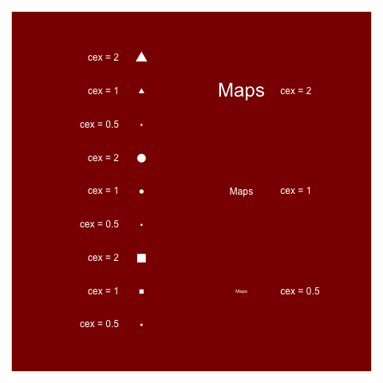
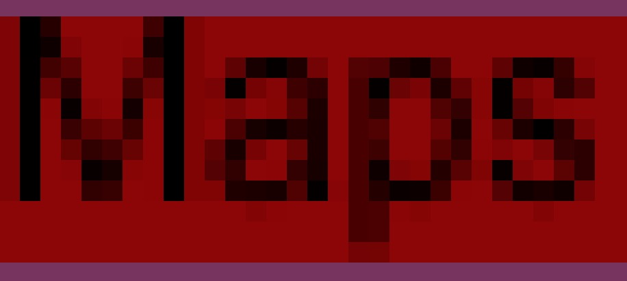
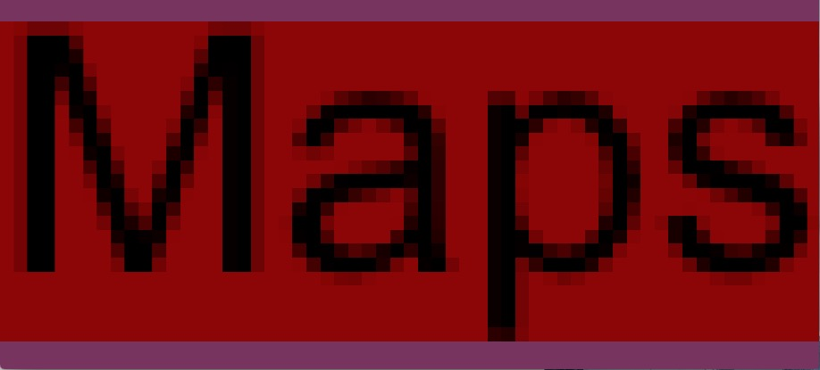

<!-- Setting knitr  -->
```{r echo=FALSE}
knitr::opts_chunk$set(
  comment = "##",
  collapse = TRUE,
  warning = FALSE,
  message = FALSE,
  dev = 'pdf'
)
```

<!-- Call our scripts -->

```{r echo = FALSE}
for (i in list.files("../scripts", pattern="*\\.R$", full.names = TRUE))
    knitr::read_chunk(i)
```


## Outline

- Introduction
- The `graphics` package basis
- Composition and multi-panel plotting
- Graphics automation and exporting
- Resources
- Exercises

--- .transition

## Introduction

--- .andy

## The importance of graphics

<q>A picture is worth a thousand words</q>

- Visual summary of data / information
- More efficient than table and text
- Useful for exploring data
    - trends, correlations, cycles, outliers, etc.
- Essential for presenting results

<br />

- But a bad graph can lie about data
- And sometimes a graphic is not the solution

--- &twocol

## The components of a graphic

<!-- *** =left -->

*** =right
```{r echo = FALSE}
<<load_data>>
<<component_1>>
```

--- &twocol

## The components of a graphic

*** =left
- Chart area

*** =right
```{r echo = FALSE}
<<component_2>>
```

--- &twocol

## The components of a graphic

*** =left
- Chart area
- Plot area

*** =right
```{r echo = FALSE}
<<component_3>>
```

--- &twocol

## The components of a graphic

*** =left
- Chart area
- Plot area
- Data representation


*** =right
```{r echo = FALSE}
<<component_4>>
```

--- &twocol

## The components of a graphic

*** =left
- Chart area
- Plot area
- Data representation
- Axis (scaling, labeling)

*** =right
```{r echo = FALSE}
<<component_5>>
```

--- &twocol

## The components of a graphic

*** =left
- Chart area
- Plot area
- Data representation
- Axis (scaling, labeling)
- Figure title

*** =right
```{r echo = FALSE}
<<component_6>>
```

--- &twocol

## The components of a graphic

*** =left
- Chart area
- Plot area
- Data representation
- Axis (scaling, labeling)
- Figure title
- Legend

*** =right
```{r echo = FALSE}
<<component_7>>
```

---

## Some guidelines for better graphics

--- &twocol

## Some guidelines for better graphics

*** =left
- Do not use pie chart
- Do not use 3D (never)
- Use consistent colors

*** =right
```{r echo = FALSE}
<<pie3d_1>>
```

--- &twocol

## Some guidelines for better graphics

*** =left
- Do not use pie chart
- Do not use 3D (never)
- Use consistent colors
- Do prefer this representation

*** =right
```{r echo = FALSE}
<<pie3d_2>>
```

--- &twocol

## Some guidelines for better graphics

*** =left
- Do not use more than 6 colors
- Do not use high contrast color

*** =right
```{r echo = FALSE}
<<bubble_1>>
```

--- &twocol

## Some guidelines for better graphics

*** =left
- Do not use more than 6 colors
- Do not use high contrast color
- Sometimes sizes and symbols are better

*** =right
```{r echo = FALSE}
<<bubble_2>>
```

--- &twocol

## Some guidelines for better graphics

*** =left
- Write textual informations horizontally
- Do not use distracting elements
- Do not add chart junk

*** =right
```{r echo = FALSE}
<<tufte_1>>
```

--- &twocol

## Some guidelines for better graphics

*** =left
- Write textual informations horizontally
- Do not use distracting elements
- Do not add chart junk
- Think about the Data-Ink ratio (Tufte, 1983)

*** =right
```{r echo = FALSE}
<<tufte_2>>
```

---

## Some guidelines for better graphics

<q>Each element of a graph has to help understanding data</q>

<q>Choose the graphic that shows what you want to show</q>


--- &twocol

## The R system

*** =left
<div style='text-align: left; margin: 10% 5%;'>
    
</div>

*** =right
- Software environment for statistical computing and graphics
- Open-source, free and multiplatform
- Widely used in the scientific community
- Programming language
- Implementation of the S programming language
- The core system is extended through user-created packages
- You can do what you want with R


---

## The R system

  
  <div class='centered'>Murrell, P. (2015) <a href="https://journal.r-project.org/archive/2015-1/murrell.pdf">The gridGraphics Package</a>. The R Jounal.</div>


--- &twocol

## Graphical packages - graphics

*** =left
- Base package
- S-like plotting functions
- Contains the famous function `plot()`
- And a lot of well-known functions: `boxplot()`, `barplot()`, `hist()`, `lines()`, `points()`, `legend()`, etc.

```{r eval = FALSE}
<<scatter_cmd>>
```

*** =right
```{r echo = FALSE}
<<scatter>>
```

--- &twocol

## Graphical packages - grid

*** =left
- An alternative set of graphical functions
- Well-suited for developers
- `ggplot2` is based on this package


*** =right
```{r echo = FALSE}
<<scatter>>
```

--- &twocol

## Graphical packages - lattice

*** =left
- Based on the `grid` package
- High-level system inspired by Trellis graphics
- Specialized on multivariate data
- and multipanel figures

```{r eval = FALSE}
<<lattice_cmd>>
```

*** =right
```{r echo = FALSE}
<<lattice>>
```

--- &twocol

## Graphical packages - ggplot2

*** =left
- Also based on the `grid` package
- A complete plotting system for R
- Based on the Grammar of Graphics
- But introduces its own syntax
- and requires a long time to master it

```{r eval = FALSE}
<<ggplot_cmd>>
```

- See the QCBS workshop on [ggplot2](http://qcbs.ca/wiki/r_workshop4)
*** =right
```{r echo = FALSE}
<<ggplot>>
```

--- &twocol

## Graphical packages - plotrix

*** =left
- Based on the `graphics` package
- Contains a lots of specialized plots (i.e. polar plots)
- and various labeling, axis and color scaling functions

```{r eval = FALSE}
<<plotrix_cmd>>
```

*** =right
```{r echo = FALSE}
<<plotrix>>
```


--- &twocol

## Graphical packages - gplots

*** =left
- Based on the `graphics` package
- Adds enhanced versions of standard plots (e.g. `boxplot2`)
- and some extra functions (e.g. Venn diagram)

```{r eval = FALSE}
<<gplots_cmd>>
```

*** =right
```{r echo = FALSE}
<<gplots>>
```

---

## Graphical packages - others

- More than 80 others graphical packages
- For an overview see this [R task view](https://cran.r-project.org/web/views/Graphics.html)
- For a more exhaustive list see this [post](http://kevincazelles.fr/rgraphics/2015/12/04/r-and-graphics.html)

<br />

- On this workshop we will only use the `graphics` package

<!-- Faudrait dire que c'est un des coûts d'avoir autant de facilité... -->

--- .transition

## The graphics package basis

--- &twocol

## Graphical parameters

*** =left
- Default values of graphical parameters are stored in `par()`
- `par()` is an object
    - we can get the value of a parameter
- `par()` is also a function
    - we can change the default values

*** =right
```{r eval = TRUE, echo = TRUE}
<<par_cmd>>
```

---

## Graphical parameters

- Important: when you change the value of one parameter, the new value affects all the graphs until the graphical window is closed

<!-- end -->

---

## Graphical parameters

- Important: when you change the value of one parameter, the new value affects all the graphs until the graphical window is closed

<!-- end -->

- A recommendation:
    - Save the default par(): `opar <- par()`
    - Change the values: `par(col='red')`
    - Do the graph
    - Restaure the old par(): `par(opar)`

---

## Graphical parameters

- Important: when you change the value of one parameter, the new value affects all the graphs until the graphical window is closed

<!-- end -->

- A recommendation:
    - Save the default par(): `opar <- par()`
    - Change the values: `par(col = 'red')`
    - Do the graph
    - Restaure the old par(): `par(opar)`

<!-- end -->

- Some graphical parameters can also be changed directly in plotting functions

---

## High-level vs. low-level plotting functions

### <u>High-level plotting functions</u>

- Open a new graphical window
- Or erase the content of the previous window
- Examples: `plot()`, `boxplot()`, `barplot()`, `hist()`, etc.

---

## High-level vs. low-level plotting functions

### <u>High-level plotting functions</u>

- Open a new graphical window
- Or erase the content of the previous window
- Examples: `plot()`, `boxplot()`, `barplot()`, `hist()`, etc.

### <u>Low-level plotting functions</u>

- Work only when a graphical window is open
- Add content to the active window
- Examples: `lines()`, `points()`, `axis()`, `legend()`, etc.

--- .tocenter

## High-level vs. low-level plotting functions

<q>You only need to know one high-level plotting function: `plot()`</q>

```{r echo = FALSE, fig.height = 4, fig.width = 12}
<<the_plot>>
```

--- &twocol

## Let's take a look at the data

*** =left
- Random data with no particular sense
- Three variables:
    - x and y: quantitative variables
    - z: qualitative variable (factor)

*** =right
```{r echo = TRUE}
<<data>>
```


--- &twocol

## An empty plot

*** =left
- The default plot
- Quite ugly, isn't it?

```{r eval = FALSE}
<<empty_1_cmd>>
```

<!-- end -->

- Now we are going to remove each component of the graph to create an empty plot

*** =right
```{r echo = FALSE}
<<empty_1>>
```

--- &twocol

## An empty plot

*** =left
- First let's remove the box
- with the argument `bty` (default: `'o'`)

```{r eval = FALSE}
<<empty_2_cmd>>
```

*** =right
```{r echo = FALSE}
<<empty_2>>
```

--- &twocol

## An empty plot

*** =left
- Now let's remove the textual annotation
- with the argument `ann` (default: `'TRUE'`)

```{r eval = FALSE}
<<empty_3_cmd>>
```

*** =right
```{r echo = FALSE}
<<empty_3>>
```

--- &twocol

## An empty plot

*** =left
- Let's remove the x-axis
- with the argument `xaxt` (default: `'s'`)


```{r eval = FALSE}
<<empty_4_cmd>>
```

*** =right
```{r echo = FALSE}
<<empty_4>>
```


--- &twocol

## An empty plot

*** =left
- And the y-axis
- with the argument `yaxt` (default: `'s'`)

```{r eval = FALSE}
<<empty_5_cmd>>
```

*** =right
```{r echo = FALSE}
<<empty_5>>
```

--- &twocol

## An empty plot

*** =left
- Using `axes=FALSE` is the same as:
- `bty='n'`+`xaxt='n'`+`yaxt='n'`

```{r eval = FALSE}
<<empty_6_cmd>>
```

*** =right
```{r echo = FALSE}
<<empty_6>>
```

--- &twocol

## An empty plot

*** =left
- Finally let's remove data
- with the argument `type` (default: `'p'`)

```{r eval = FALSE}
<<empty_7_cmd>>
```

<!-- end -->

*** =right
```{r echo = FALSE}
<<empty_7>>
```

--- &twocol

## An empty plot

*** =left
- Finally let's remove data
- with the argument `type` (default: `'p'`)

```{r eval = FALSE}
<<empty_7_cmd>>
```

<!-- end -->

- In an empty plot, visual information is not displayed but the graph is defined in the window
- It is now possible to use low-level plotting functions such as `points()` or `axis()`

*** =right
```{r echo = FALSE}
<<empty_7>>
```

---

## An empty plot, and now what?

- Now we've got an empty plot
- We are going to add some informations to:
    - discover useful low-level plotting functions,
    - improve the quality of the default plot

<!-- end -->

- Let's go!

--- &twocol

## Adding points

*** =left

- We will use the function `points()`
- It shares some arguments with the function `plot()`

```{r eval = FALSE}
<<points_1_cmd>>
```


*** =right

```{r echo = FALSE}
<<points_1>>
```

--- &twocol

## Adding points

*** =left

- We can customize the points with:
    - `cex`, the size
    - `col`, the color
    - `pch`, the symbol

```{r eval = FALSE}
<<points_2_cmd>>
```


*** =right

```{r echo = FALSE}
<<points_2>>
```

--- &twocol

## Adding points

*** =left

- Some symbols have two colors:
    - `col`: the border color,
    - `bg `: the background color
- This is the case for `pch` = 21 to 25

```{r eval = FALSE}
<<points_3_cmd>>
```

*** =right

```{r echo = FALSE}
<<points_3>>
```


--- &twocol

## Adding lines

*** =left

- Four functions allow to plot lines:
    - `points()`
    - `lines()`
    - `abline()`
    - `segments()`
- We will illustrate these functions with a linear regression


*** =right

```{r eval = TRUE}
<<regression>>
```

--- &twocol

## Adding lines

*** =left

- First, let's try the function `abline()`
- with the first way

```{r eval = FALSE}
<<lines_1_cmd>>
```

*** =right

```{r echo = FALSE}
<<lines_1>>
```


--- &twocol

## Adding lines

*** =left

- The second way is to specify model parameters

```{r eval = FALSE}
<<lines_2_cmd>>
```

*** =right

```{r echo = FALSE}
<<lines_2>>
```


--- &twocol

## Adding lines

*** =left

- The function `abline()` allows to draw horizontal and vertical lines

```{r eval = FALSE}
<<lines_3_cmd>>
```

*** =right

```{r echo = FALSE}
<<lines_3>>
```

--- &twocol

## Adding lines

*** =left

- Now take a look at the functions `lines()` and `points()`
- But first, we are going to predict the model on new data

*** =right

```{r eval = TRUE}
<<predict>>
```

--- &twocol

## Adding lines

*** =left

- Let's add model regression with the functions `lines()` and `points()`

```{r eval = FALSE}
<<lines_4_cmd>>
```

*** =right

```{r echo = FALSE}
<<lines_4>>
```

--- &twocol

## Adding lines

*** =left

- We can customize the lines with:
    - `lwd`, the line width
    - `col`, the line color
    - `lty`, the line type

```{r eval = FALSE}
<<lines_5_cmd>>
```

*** =right

```{r echo = FALSE}
<<lines_5>>
```

--- &twocol

## Adding polygons

*** =left

- To add a polygon, the function is `polygon()`
- A special, the rectangle can be drawn with `rect()`
- Let's predict again the model, but this time with the standard error

*** =right
```{r eval = TRUE}
<<predict_2>>
```


--- &twocol

## Adding polygons

*** =left

- We are going to add the error envelope with the function `polygon()`
- So, let's calculate the coordinates of this envelope

*** =right
```{r eval = TRUE}
<<order_pred>>
```

--- &twocol

## Adding polygons

*** =left

- Let's add model error envelope

```{r eval = FALSE}
<<polygons_1_cmd>>
```

*** =right

```{r echo = FALSE}
<<polygons_1>>
```

--- &twocol

## Adding polygons

*** =left

- We can customize the polygon with:
    - `border`, the border color
    - `col`, the background color
    - `lwd`, the border width

```{r eval = FALSE}
<<polygons_2_cmd>>
```

*** =right

```{r echo = FALSE}
<<polygons_2>>
```

--- &twocol

## Adding polygons

*** =left

- Finally

```{r eval = FALSE}
<<polygons_3_cmd>>
```

*** =right

```{r echo = FALSE}
<<polygons_3>>
```

--- &twocol

## Adding polygons

*** =left

- `rect()` is appropriated when you want to add draw rectangle
- Here is an example

```{r eval = FALSE}
<<rect_1_cmd>>
```

*** =right

```{r echo = FALSE}
<<rect_1>>
```

--- &twocol

## Adding polygons

*** =left

- You also can customize the rectangle

```{r eval = FALSE}
<<rect_2_cmd>>
```

*** =right

```{r echo = FALSE}
<<rect_2>>
```

--- &twocol

## Adding textual informations

*** =left

- Let's see now how to add text
- First let's add a main title with the function `title()`

```{r eval = FALSE}
<<text_1_cmd>>
```

*** =right

```{r echo = FALSE}
<<text_1>>
```


--- &twocol

## Adding textual informations

*** =left

- What about adding text in the plot area?
- We will use the function `text()`
- Here is a first example:

```{r eval = FALSE}
<<text_2_cmd>>
```

*** =right

```{r echo = FALSE}
<<text_2>>
```

--- &twocol

## Adding textual informations

*** =left

- another example

```{r eval = FALSE}
<<text_5_cmd>>
```

*** =right

```{r echo = FALSE}
<<text_5>>
```

--- &twocol

## Adding textual informations

*** =left

- Let's customize a little the text with:
    - `cex`, the size
    - `col`, the color
    - `font`, the font (bold, italic, etc.)
    - `family`, the typeface

```{r eval = FALSE}
<<text_3_cmd>>
```

*** =right

```{r echo = FALSE}
<<text_3>>
```


--- &twocol

## Adding textual informations

*** =left

- Finally, let's customize the orientation and position
    - `srt`, the rotation angle
    - `pos`, the position from coordinates

```{r eval = FALSE}
<<text_4_cmd>>
```

*** =right

```{r echo = FALSE}
<<text_4>>
```

--- &twocol

## Adding textual informations

*** =left

- But the function `text()` can't add text outside the plot area
- except if `par(xpd=TRUE)`
- We will use the function `mtext()`

```{r eval = FALSE}
<<text_6_cmd>>
```

*** =right

```{r echo = FALSE}
<<text_6>>
```

---

## Back to colors

- R has some predefine colors palettes

```{r eval = TRUE}
## Basic colors
palette()

## and 657 others colors
colors()[1:10]
```

--- &twocol

## Back to colors

*** =left

- You can define colors in the RGB system with `rgb()`
- You specify value between 0 to 1 for each primary colors
- For example:

```{r eval = FALSE}
red    <- rgb(red = 1,   green = 0,   blue = 0)
yellow <- rgb(red = 1,   green = 1,   blue = 0)
gray1  <- rgb(red = 0.5, green = 0.5, blue = 0.5)
```

<!-- *** =right -->

--- &twocol

## Back to colors

*** =left

- You can define colors in the RGB system with `rgb()`
- You specify value between 0 to 1 for each primary colors
- For example:

```{r eval = FALSE}
red    <- rgb(red = 1,   green = 0,   blue = 0)
yellow <- rgb(red = 1,   green = 1,   blue = 0)
gray1  <- rgb(red = 0.5, green = 0.5, blue = 0.5)
```

*** =right
- The `alpha` argument controls for opacity (default = `1`)
- Its values vary from 0 (transparent) to 1 (opaque)
- For example

```{r echo = TRUE}
## Transparent red
redp <- rgb(red = 1, green = 0, blue = 0,
            alpha = .8)
```

--- &twocol

## Back to colors

*** =left

- Let's see an application

```{r eval = FALSE}
## Empty plot
plot(x = dat$x, y = dat$y, ann = FALSE,
     bty = 'n', type = 'n')

## Transparent red
redp <- rgb(red = 1, green = 0, blue = 0,
            alpha = .5)

## Adding points
points(x = dat$x, y = dat$y, col = redp,
       pch = 19, cex = 4)
```

*** =right
```{r echo = FALSE}
## Empty plot
plot(x = dat$x, y = dat$y, ann = FALSE,
     bty = 'n', type = 'n')

## Transparent red
redp <- rgb(red = 1, green = 0, blue = 0,
            alpha = .5)

## Adding points
points(x = dat$x, y = dat$y, col = redp,
       pch = 19, cex = 4)
```

--- &twocol

## Back to colors

*** =left

- You can also define colors in the hexadecimal system
- Each primary colors is define by two values varying from 0 to 9 and A to F
- For example:

```{r eval = FALSE}
red    <- '#FF0000'
yellow <- '#FFFF00'
gray1  <- '#888888'
```

<!-- *** =right -->

--- &twocol

## Back to colors

*** =left

- You can also define colors in the hexadecimal system
- Each primary colors is define by two values varying from 0 to 9 and A to F
- For example:

```{r eval = FALSE}
red    <- '#FF0000'
yellow <- '#FFFF00'
gray1  <- '#888888'
```

*** =right
- To add transparency, we have to add two hexadecimal character at the end
- For example,

```{r eval = FALSE}
## Transparent red
redp <- '#FF000088'
```

--- &twocol

## Adding axis

*** =left
- The function `axis()` allows to add axis
- Here is an example of usage

```{r eval = FALSE}
## Empty plot
plot(x = dat$x, y = dat$y, pch = 19)

## Adding top-axis
axis(side = 3, at = seq(0.6, 1.4, by = 0.1),
     labels = seq(0.6, 1.4, by = 0.1), las = 1)

## Adding right-axis
axis(side = 4, at = seq(0.8, 1.2, by = 0.1),
     labels = format(seq(0.8, 1.2, by = 0.1)),
     las = 2)
```

*** =right
```{r echo = FALSE}
## Empty plot
plot(x = dat$x, y = dat$y, pch = 19)

## Adding top-axis
axis(side = 3, at = seq(0.6, 1.4, by = 0.1),
     labels = seq(0.6, 1.4, by = 0.1), las = 1)

## Adding right-axis
axis(side = 4, at = seq(0.8, 1.2, by = 0.1),
     labels = format(seq(0.8, 1.2, by = 0.1)),
     las = 2)
```

--- &twocol

## Figure margins

*** =left
- To change the figure margins you have to change the values of the parameter `mar` in the `par()`
- The order is the follow: bottom, left, top and right
- For example:

```{r eval = FALSE}
par(mar = c(4, 4, 4, 4))
```

<!-- *** =right -->

--- &twocol

## Exercise 1

*** =left

- Objective: reproduce this figure
- Using the dataset `iris.txt` (Dropbox)

```{r echo = TRUE}
head(tab)
```

*** =right

- The size of the bubble is proportional to `n`
- Lines represent regression model and standard error

--- .tocenter2

## Exercise 1

```{r echo = FALSE, fig.height = 7, fig.width = 7}
<<Exercise_1>>
```

--- .transition

## Composition and multipanel plotting

*** =right
```{r, echo = FALSE}
<<kccolors>>
<<kcfunction>>
```


--- &twocol

## Dividing the output device

*** =left
- `mfrow` and `mfcol` in `par()`

```{r, eval = FALSE}
par(mfrow=c(2,2))
```
or

```{r, eval = FALSE}
par(mfcol=c(2,2))
```

*** =right
```{r, echo = FALSE}
<<mfrow>>
```


--- &twocol

## Dividing the output device

*** =left
- `mfrow` and `mfcol` in `par()`
- `split.screen()`

```{r, eval = FALSE}
split.screen(c(1, 2))
split.screen(c(3, 1), screen = 2)
```

*** =right
```{r, echo = FALSE}
<<screen>>
```


--- &twocol

## Dividing the output device

*** =left
- mfrow and mfcol in `par()`
- `split.screen()`
- layout()

```{r, eval = FALSE}
mat_lay <- matrix(c(1,2,4,1,3,4),nrow=3)
layout(mat_lay)
```

*** =right
```{r, echo = FALSE}
<<layout>>
```


--- &twocol

## More about 'layout()'

*** =left

```{r, eval = FALSE}
mat_lay <- matrix(c(1,2,4,1,3,4), nrow=3)
layout(mat_lay)
```

```{r, echo = FALSE}
matrix(c(1,2,4,1,3,4), nrow=3)
```

*** =right
```{r, echo = FALSE}
<<laymat1>>
```


--- &twocol

## More about 'layout()'

*** =left

```{r, eval = FALSE}
mat_lay <- matrix(c(0,2,2,1,3,3,1,4,0), nrow=3)
layout(mat_lay)
```

```{r, echo = FALSE}
matrix(c(0,2,2,1,3,3,1,4,0), nrow=3)
```

*** =right
```{r, echo = FALSE}
<<laymat2>>
```


--- &twocol

## More about 'layout()'

*** =left

```{r, eval = FALSE}
mat_lay <- matrix(c(0,2,2,1,3,3,1,4,0),nrow=3)
layout(mat_lay, widths=c(.25,1,1))
```

*** =right
```{r, echo = FALSE}
<<laywd>>
```


--- &twocol

## More about 'layout()'

*** =left

```{r, eval = FALSE}
mat_lay <- matrix(c(0,2,2,1,3,3,1,4,0),nrow=3)
layout(mat_lay, widths=c(.25,1,1),
  heights=c(.25,1,.25))
```

*** =right
```{r, echo = FALSE}
<<layhg>>
```


--- &twocol

## Combining 'layout()' and 'mar'

*** =left

```{r, eval = FALSE}
<<laymar>>
```

*** =right
```{r, echo = FALSE}
<<laymar>>
```


--- &twocol

## Embedded plots

*** =left

- You must call `new=TRUE` and specifying `fig` in `par()`:

  1. create your first plot;

```{r, eval = FALSE}
  plot(...)
```


*** =right

```{r, echo = FALSE}
<<fignew1>>
```


--- &twocol

## Embedded plots

*** =left

- You must call `new=TRUE` and specifying `fig` in `par()`:

  1. create your first plot;
  2. use `par()`;

```{r, eval = FALSE}
  plot(...)
  par(new=TRUE, fig=c(0.5,1,0.5,1))
```


*** =right

```{r, echo = FALSE}
  <<fignew1>>
```


--- &twocol

## Embedded plots

*** =left

- You must call `new=TRUE` and specifying `fig` in `par()`:

  1. create your first plot;
  2. use `par()`;
  3. add your embedded plot;

  ```{r, eval = FALSE}
    plot(...)
    par(new=TRUE, fig=c(0.5,1,0.5,1))
    plot(...)
  ```

*** =right

```{r, echo = FALSE}
<<fignew2>>
```

<!-- http://www.r-bloggers.com/digging-up-embedded-plots/ -->


--- .transition

## Exporting figures from the command line


---

## grDevices


<div class='centered'>Murrell, P. (2015) <a href="https://journal.r-project.org/archive/2015-1/murrell.pdf">The gridGraphics Package</a>. The R Jounal.</div>


---

## grDevices


```r
options('device')
```

- Devices available  &nbsp;&nbsp;[<i class="fa fa-globe" aria-hidden="true"></i>](https://stat.ethz.ch/R-manual/R-devel/library/grDevices/html/Devices.html):
  - Quartz &nbsp;&nbsp;[<i class="fa fa-globe" aria-hidden="true"></i>](https://en.wikipedia.org/wiki/Quartz_(graphics_layer)
  - X11 &nbsp;&nbsp; [<i class="fa fa-globe" aria-hidden="true"></i>](https://en.wikipedia.org/wiki/X_Window_System)
  - pdf, jpeg, svg, ...
  - in add-on package :
      -  [rgl  package](https://cran.r-project.org/web/packages/rgl/index.html) (OpenGL website &nbsp;&nbsp; [<i class="fa fa-globe" aria-hidden="true"></i>](https://www.opengl.org))
      - Internet browsers [googleVis](https://stat.ethz.ch/R-manual/R-devel/library/grDevices/html/Devices.html)


--- &twocol

## Exporting figures as bitmap files

*** =left

- `bmp()`, `jpeg()`, `png()`, `tiff()`

```r
?jpeg
```

- use them:

```r
png(filename, width=480, height=480)
...
dev.off()
```

*** =right

```{r, echo = FALSE, results='hide'}
<<export1>>
```




--- &twocol

## Exporting figures as bitmap files

*** =left

```r
png(filename, width=1440, height=1440)
...
dev.off()
```

*** =right

```{r, echo = FALSE, results='hide'}
<<export2>>
```


---

## Exporting figures as bitmap files


> - pixel (px) = small colored square;
> - `width=480` + `height=480` = grid of 480x480px ;
> - point (pt) = unit of length (measures the height of a font);
> - 1pt = 1/72 inch;
> - `pointsize` of plotted text = how many points your font will use (size of the text);
> - resolution `res` (in px per inch, *ppi*) links pixel and size;
> - `res` determines how many pixels = 1pt;
> - if `res=72` then one point will equal exactly one pixel.
> - `res=72` + `width=480` + `height=480` =  6.667x6.667in => 16.9*16.9cm
> - `res=300` + `width=480` + `height=480` =  1.6x1.6in =>  4.06cmx4.06cm
> - font 12 points => 0.42cm


--- &twocol

## Exporting figures as bitmap files

*** =left


```r
jpeg(filename, res=72,
  pointsize=12, width=480, height=480)
...
dev.off()
```

*** =right

```{r, echo = FALSE, results='hide'}
<<export3>>
```


--- &twocol

## Exporting figures as bitmap files

*** =left



- pointsize=12
- res=72
- cex=1

*** =right



- pointsize=12
- res=72
- cex=2


--- &twocol

## Exporting figures as bitmap files

*** =left

```r
png(filename, res=144)
...
dev.off()
```

*** =right

```{r, echo = FALSE, results='hide'}
<<export4>>
```


--- &twocol

## Exporting figures as bitmap files

*** =left

```r
png(filename, res=144,
  height=7, width=7, unit="in")
...
dev.off()
```

*** =right

```{r, echo = FALSE, results='hide'}
<<export5>>
```


--- &twocol

## Exporting figures as bitmap files

*** =left

```r
png(filename, res=288,
   height=7, width=7, unit="in")
...
dev.off()
```

*** =right

```{r, echo = FALSE, results='hide'}
<<export6>>
```


--- &twocol

## Exporting figures as bitmap files

*** =left

```r
png(filename, res=288,
  height=7, width=7, unit="in")
...
dev.off()
```

*** =right

```{r, echo = FALSE, results='hide'}
<<export7>>
```


--- &twocol

## Exporting figures as bitmap files

*** =left

```r
png(filename, res=288,
  height=2*7, width=7, unit="in")
...
dev.off()
```

*** =right

```{r, echo = FALSE, results='hide'}
<<export8>>
```


--- &twocol

## Exporting figures as vector files


- `pdf()`;
- Cairo  &nbsp;&nbsp;[<i class="fa fa-globe" aria-hidden="true"></i>](https://cairographics.org/documentation/) :
    - `cairo_pdf()`
    - `cairo_ps()`
    - `svg()`


--- &twocol

## Exporting figures as vector files

*** =left

```r
pdf(fil, pointsize=12,
  height=2*7, width=7)
...
dev.off()
```

*** =right

```{r, echo = FALSE, results='hide'}
<<pdf1>>
```


--- &twocol

## Exporting figures as vector files

*** =left

```r
svg(filename, pointsize=12,
  height=2*7, width=7)
...
dev.off()
```

*** =right

```{r, echo = FALSE, results='hide'}
<<svg1>>
```


--- .transition
## Let's practice!


---
## Exercise 2

Reproduce the [figure depicting distribution of english letters made by David Taylor](http://www.prooffreader.com/2014/05/graphing-distribution-of-english.html) :

- **advanced users** : try to find relevant data and to reproduce the methodology described;

- **beginners** : use the data ('data/word_eng.Rdata' file available on &nbsp;&nbsp;[<i class="fa fa-github" aria-hidden="true"></i>](https://github.com/KevCaz/QCBSgraphR).


--- .transition
## Resources


---
## Resources

- CRAN task view for graphs &nbsp;&nbsp;[<i class="fa fa-globe" aria-hidden="true"></i>](https://cran.r-project.org/web/views/Graphics.html)
- more R packages indexed &nbsp;&nbsp;[<i class="fa fa-globe" aria-hidden="true"></i>](http://kevincazelles.fr/rgraphics/2015/12/04/r-and-graphics.html)
- ggplot2 website &nbsp;&nbsp;[<i class="fa fa-globe" aria-hidden="true"></i>](http://docs.ggplot2.org/current/)
